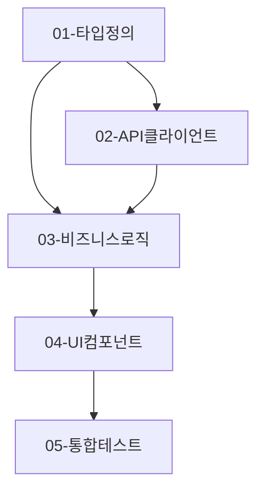

# Step 3: 구현 계획 결과

## 1. 요약

| 항목                | 내용                        |
| ------------------- | --------------------------- |
| **총 서브태스크**   | [N]개                       |
| **병렬 가능**       | [M]개                       |
| **TDD 적용 태스크** | [K]개 (TS-xxx 할당)         |
| **예상 실행 순서**  | Phase 1 → Phase 2 → Phase 3 |

## 2. Step 2 입력 확인

> Step 2 설계가 서브태스크로 올바르게 변환되었는지 확인합니다.

### 2.1 파일별 구현 계획 → 서브태스크 매핑

| Step 2 파일 (5.1)      | 서브태스크 | 관련 TS (4.3)  | 상태      |
| ---------------------- | ---------- | -------------- | --------- |
| types/feature.types.ts | 01-TASK    | -              | ✅ 변환됨 |
| api/feature.api.ts     | 02-TASK    | TS-101, TS-102 | ✅ 변환됨 |
| hooks/useFeature.ts    | 03-TASK    | TS-001, TS-002 | ✅ 변환됨 |
| components/Feature.tsx | 04-TASK    | -              | ✅ 변환됨 |

### 2.2 코드 패턴/금지사항 반영

- [ ] Step 2 6.1 코드 패턴 → TASK_MASTER에 포함됨
- [ ] Step 2 6.2 금지 사항 → TASK_MASTER에 포함됨
- [ ] Step 2 7.2 리뷰 체크포인트 → 완료 조건으로 반영됨

## 3. 서브태스크 개요

| 번호 | 제목           | 파일                          | 관련 TS        | 우선순위 | 의존성 |
| ---- | -------------- | ----------------------------- | -------------- | -------- | ------ |
| 01   | 타입 정의      | types/feature.types.ts        | -              | P0       | None   |
| 02   | API 클라이언트 | api/feature.api.ts            | TS-101, TS-102 | P0       | 01     |
| 03   | 비즈니스 로직  | hooks/useFeature.ts           | TS-001, TS-002 | P1       | 01, 02 |
| 04   | UI 컴포넌트    | components/Feature.tsx        | -              | P1       | 03     |
| 05   | 통합 테스트    | **tests**/integration.test.ts | 전체 TS        | P2       | 01-04  |

## 4. TDD 요구사항 할당

> Step 1의 테스트 시나리오(8번)와 Step 2의 테스트 매핑(4.3)을 결합했습니다.

### 4.1 태스크별 TS 할당

| 태스크  | TS ID  | 시나리오             | 테스트 유형 |
| ------- | ------ | -------------------- | ----------- |
| 02-TASK | TS-101 | [정상 API 응답]      | Unit (MSW)  |
| 02-TASK | TS-102 | [에러 API 응답]      | Unit (MSW)  |
| 03-TASK | TS-001 | [정상 비즈니스 로직] | Unit        |
| 03-TASK | TS-002 | [엣지 케이스]        | Unit        |

### 4.2 테스트 시나리오 상세 (Step 1 8번에서)

| TS ID  | Given (전제)          | When (동작)           | Then (결과)           |
| ------ | --------------------- | --------------------- | --------------------- |
| TS-001 | [Step 1 8.1에서 복사] | [Step 1 8.1에서 복사] | [Step 1 8.1에서 복사] |
| TS-002 | [Step 1 8.1에서 복사] | [Step 1 8.1에서 복사] | [Step 1 8.1에서 복사] |
| TS-101 | [Step 1 8.2에서 복사] | [Step 1 8.2에서 복사] | [Step 1 8.2에서 복사] |
| TS-102 | [Step 1 8.2에서 복사] | [Step 1 8.2에서 복사] | [Step 1 8.2에서 복사] |

## 5. 의존성 그래프



**병렬 실행 가능:**

- Phase 1: 01 (단독)
- Phase 2: 02, 03 일부 (01 완료 후)

## 6. 실행 계획

### Phase 1: 기반 구조 (P0)

**목표**: 타입 정의 및 기반 구조 완성

- [ ] `01-TASK.md` - 타입 정의

**완료 조건**: 모든 인터페이스/타입 정의 완료

### Phase 2: 핵심 기능 (P0-P1)

**목표**: API 연동 및 비즈니스 로직 구현

- [ ] `02-TASK.md` - API 클라이언트 (TS-101, TS-102 통과)
- [ ] `03-TASK.md` - 비즈니스 로직 (TS-001, TS-002 통과)

**완료 조건**: 모든 관련 TS-xxx 테스트 통과

### Phase 3: UI 및 통합 (P1-P2)

**목표**: UI 컴포넌트 및 전체 통합

- [ ] `04-TASK.md` - UI 컴포넌트
- [ ] `05-TASK.md` - 통합 테스트

**완료 조건**: 전체 기능 동작 확인

## 7. TASK_MASTER 지침 요약

### 코드 패턴 (Step 2 6.1에서)

```typescript
// [Step 2에서 정의한 패턴 참조]
```

### 금지 사항 (Step 2 6.2에서)

- [ ] `any` 타입 사용 금지
- [ ] 인라인 스타일 금지
- [ ] `console.log` 커밋 금지
- [ ] [추가 금지 사항]

### 완료 조건 (Step 2 7.2에서)

- [ ] 모든 관련 TS-xxx 테스트 통과
- [ ] 코드 패턴 가이드 준수
- [ ] 금지 사항 위반 없음

## 8. 생성된 파일

```
.ai/tasks/<TASK_ID>/todos/
├── 00-TASK_MASTER.md       # 전체 조율 문서
├── 01-TASK.md              # 타입 정의
├── 02-TASK.md              # API 클라이언트
├── 03-TASK.md              # 비즈니스 로직
├── 04-TASK.md              # UI 컴포넌트
└── 05-TASK.md              # 통합 테스트
```

## 9. 다음 단계

### 수동 실행

```bash
# 1. 원하는 태스크 파일 읽기
cat .ai/tasks/<TASK_ID>/todos/01-TASK.md

# 2. 해당 태스크 구현 (TDD: 테스트 먼저)
# 3. 완료 후 TASK_MASTER.md 상태 업데이트
```

### 자동 실행

```bash
# task-master agent가 TASK_MASTER.md를 읽고
# 서브에이전트들을 spawn하여 병렬로 작업 수행
```

## 10. 주의사항

- **TDD 원칙**: 각 태스크는 관련 TS-xxx 테스트를 먼저 작성
- **컨텍스트 격리**: 각 서브태스크는 해당 TASK.md만 참조
- **의존성 준수**: 차단된 태스크는 의존성 완료 후 시작
- **상태 동기화**: TASK_MASTER.md 진행 상황 표 업데이트 필수
