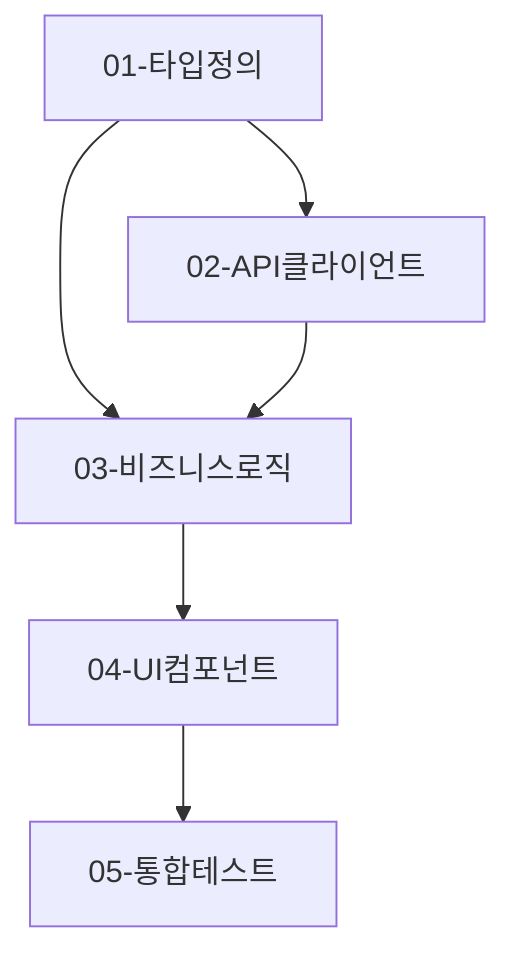

# Task Master: <TASK_ID>

> 전체 작업 조율 및 서브태스크 관리

## INSTRUCTION

### 컨텍스트 원칙 (Progressive Disclosure)

각 서브태스크는 독립적으로 실행되며, 전체 컨텍스트가 아닌 해당 태스크에 필요한 정보만 포함합니다.

- **TASK_MASTER**: 전체 구조, 의존성, 우선순위 관리
- **개별 TASK**: 해당 작업의 구현 상세만 포함

### TDD 원칙

**각 태스크는 다음 순서로 진행:**

1. 관련 TS-xxx 테스트 코드 먼저 작성
2. 테스트 실패 확인 (Red)
3. 구현 코드 작성 (Green)
4. 리팩토링 (Refactor)

### 코드 패턴 가이드 (Step 2 6.1에서)

**Hook 패턴:**

```typescript
// 참조: [Step 2에서 정의한 경로]
```

**컴포넌트 패턴:**

```typescript
// 참조: [Step 2에서 정의한 경로]
```

**API 호출 패턴:**

```typescript
// 참조: [Step 2에서 정의한 경로]
```

### 금지 사항 (Step 2 6.2에서)

- [ ] `any` 타입 사용 금지
- [ ] 인라인 스타일 금지 (CSS-in-JS / Tailwind 사용)
- [ ] `console.log` 커밋 금지
- [ ] 하드코딩된 문자열 금지 (상수/i18n 사용)
- [ ] [프로젝트 특화 규칙]

### 완료 조건 (Step 2 7.2에서)

각 태스크 완료 시 다음을 확인:

- [ ] 관련 TS-xxx 테스트 모두 통과
- [ ] 코드 패턴 가이드 준수
- [ ] 금지 사항 위반 없음
- [ ] Git 커밋 완료

### Git 규칙

```bash
git commit -m "feat(<TASK_ID>): [요약] - task-[NUM]"

# 예시
git commit -m "feat(PROJ-001): implement API client - task-02"
```

---

## 전체 구조

### 아키텍처 개요 (Step 2 3.1에서)

```
[Step 2 디렉토리 구조 복사]
```

### 데이터 흐름 (Step 2 3.3에서)

```
[Step 2 데이터 흐름 복사]
```

---

## 서브태스크 목록

### Step 2 파일별 구현 계획 → 태스크 매핑

| Step 2 파일            | 태스크  | 관련 TS        |
| ---------------------- | ------- | -------------- |
| types/feature.types.ts | 01-TASK | -              |
| api/feature.api.ts     | 02-TASK | TS-101, TS-102 |
| hooks/useFeature.ts    | 03-TASK | TS-001, TS-002 |
| components/Feature.tsx | 04-TASK | -              |
| **tests**/\*           | 05-TASK | 전체 TS        |

### 우선순위별 분류

#### P0 - Critical (병렬 가능)

- `01-TASK.md` - 타입 정의

#### P1 - High (P0 완료 후)

- `02-TASK.md` - API 클라이언트 (TS-101, TS-102)
- `03-TASK.md` - 비즈니스 로직 (TS-001, TS-002)
- `04-TASK.md` - UI 컴포넌트

#### P2 - Medium

- `05-TASK.md` - 통합 테스트

### 의존성 그래프



---

## 실행 계획

### Phase 1: 기반 구조

- [ ] `01-TASK.md` - 타입 정의

### Phase 2: 핵심 기능

- [ ] `02-TASK.md` - API 클라이언트
- [ ] `03-TASK.md` - 비즈니스 로직

### Phase 3: UI 및 통합

- [ ] `04-TASK.md` - UI 컴포넌트
- [ ] `05-TASK.md` - 통합 테스트

---

## Team 실행 계획

> Step 4에서 Coordinator가 Agent Team 스폰 시 이 섹션을 참조합니다.

### Worker 구성

- Worker 수: {N}명 (최대 병렬도 기반)
- Worker 이름: impl-worker-1 ~ impl-worker-{N}

### TaskCreate 매핑

| todos 파일 | Team Task subject | blockedBy |
|------------|-------------------|-----------|
| 01-TASK.md | impl: 타입 정의 | - |
| 02-TASK.md | impl: API 클라이언트 | Task #1 |
| 03-TASK.md | impl: 비즈니스 로직 | Task #1, #2 |
| 04-TASK.md | impl: UI 컴포넌트 | Task #3 |
| 05-TASK.md | impl: 통합 테스트 | Task #4 |

---

## 진행 상황

| 태스크  | 파일       | 관련 TS        | 상태    | 테스트 결과 | 완료일 |
| ------- | ---------- | -------------- | ------- | ----------- | ------ |
| 01-TASK | types      | -              | pending | -           | -      |
| 02-TASK | api        | TS-101, TS-102 | pending | -           | -      |
| 03-TASK | hooks      | TS-001, TS-002 | pending | -           | -      |
| 04-TASK | components | -              | pending | -           | -      |
| 05-TASK | tests      | 전체 TS        | pending | -           | -      |

---

## 테스트 시나리오 현황

> Step 1에서 정의한 테스트 시나리오의 구현 현황

| TS ID  | 시나리오     | 담당 태스크 | 구현 상태 | 테스트 결과 |
| ------ | ------------ | ----------- | --------- | ----------- |
| TS-001 | [시나리오명] | 03-TASK     | pending   | -           |
| TS-002 | [시나리오명] | 03-TASK     | pending   | -           |
| TS-101 | [시나리오명] | 02-TASK     | pending   | -           |
| TS-102 | [시나리오명] | 02-TASK     | pending   | -           |

---

## 완료 조건

### 태스크 레벨

각 태스크 완료 시:

- [ ] 관련 TS-xxx 테스트 통과
- [ ] 코드 패턴 준수
- [ ] 금지 사항 위반 없음
- [ ] Git 커밋 완료
- [ ] 진행 상황 표 업데이트

### 전체 완료

모든 서브태스크 완료 후:

- [ ] 모든 TS-xxx 테스트 통과
- [ ] 전체 통합 테스트 통과
- [ ] Step 2 7.2 리뷰 체크포인트 충족
- [ ] 40-output-implementation.md 작성

---

## Step 4 종료 처리

> **중요**: 모든 서브태스크가 completed 상태가 되면 아래 절차를 **반드시** 수행합니다.

### 1. 완료 확인

```bash
# 진행 상황 테이블에서 모든 태스크가 completed인지 확인
# 모든 TS-xxx 테스트가 통과인지 확인
```

### 2. 40-output-implementation.md 생성 (필수)

템플릿 기반으로 구현 결과 문서를 작성합니다:

```bash
# 출력 파일 위치
.ai/tasks/<TASK_ID>/40-output-implementation.md
```

**포함 내용**:

- Step 2 설계 대비 구현 현황
- TS-xxx 테스트 검증 결과
- 리뷰 체크포인트 검증 결과
- 변경 파일 목록

### 3. status.yaml 업데이트

```yaml
current_step: step-5
steps:
  step-4:
    status: completed
  step-5:
    status: pending
```

### 4. Git 커밋

```bash
git add .ai/tasks/<TASK_ID>/40-output-implementation.md
git add .ai/tasks/<TASK_ID>/status.yaml
git commit -m "feat(<TASK_ID>): complete Step 4 implementation"
```

### 5. 다음 Step 안내

```
✅ Step 4 완료!

새 대화에서 다음 명령어로 Step 5를 시작하세요:
"<TASK_ID> 작업 이어서 진행해줘"
```
