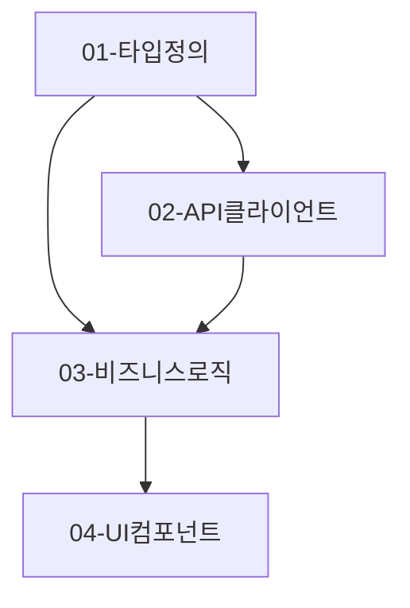

# Step 3: 구현 계획

> **컨텍스트 경계**
> 이 Step은 독립적인 계획 세션입니다. 이전 대화 맥락을 배제하고 아래 지시사항만 따르세요.
> 이렇게 하는 이유: Step 2 설계를 실행 가능한 태스크 단위로 변환하는 데 집중해야 합니다.

---

## 규칙 로드 (필수)

**이 Step을 시작하기 전에 다음 규칙을 로드하세요:**

1. **규칙 인덱스 읽기**: [assets/rules/AGENTS.md](../assets/rules/AGENTS.md)
2. **필수 규칙 로드**: `MUST/workflow-rule.md` (항상)
3. **도메인 규칙 확인**: 태스크 분해 대상에 따라 동적 로드
   - 예: 테스트 태스크 분해 → `testing/AGENTS.md`

**빠른 체크:**

```
□ MUST/workflow-rule.md 로드함
□ Step 3 입력 파일: 10-output-plan.md, 20-output-system-design.md 존재 확인
□ status.yaml에서 Step 2 completed 확인
```

---

## 역할 그룹 정의

구현 계획, 태스크 분해, 병렬화 전략에 전문성을 가진 **Implementation Planning 전문가 그룹**이 다음 관점에서 계획을 수립한다고 시뮬레이션하세요:

| 관점              | 분석 초점                                        |
| ----------------- | ------------------------------------------------ |
| **태스크 분해자** | Step 2 파일별 계획 → 실행 가능한 서브태스크 변환 |
| **의존성 분석가** | 병렬 실행 가능성, 실행 순서 최적화               |
| **TDD 조율자**    | TS-xxx 시나리오 → 각 태스크 테스트 요구사항 할당 |
| **품질 관리자**   | Step 2 코드 패턴/금지사항 → TASK_MASTER 지침     |

각 관점의 분석 결과를 종합하여 LLM이 병렬로 실행 가능한 태스크 구조를 도출합니다.

## 책임

1. **Step 2 입력 변환**: 파일별 구현 계획을 실행 가능한 서브태스크로 변환합니다.
2. **TDD 요구사항 할당**: Step 1의 TS-xxx 시나리오를 각 태스크에 할당합니다.
3. **의존성 분석**: 태스크 간 의존성을 파악하고 병렬화 기회를 찾습니다.
4. **TASK_MASTER 작성**: 전체 조율 문서와 각 서브태스크 문서를 생성합니다.

---

## 작업 흐름

### Phase 1: 입력 및 출력 구조 파악

**입력 수집:**

1. `.ai/tasks/<TASK_ID>/10-output-plan.md` (Step 1 출력)를 읽고 다음을 확인합니다:

| Step 1 섹션             | 확인 내용                         | 활용                      |
| ----------------------- | --------------------------------- | ------------------------- |
| 8. 핵심 테스트 시나리오 | TS-xxx의 **Given-When-Then 상세** | 각 TASK.md의 TDD 요구사항 |

2. `.ai/tasks/<TASK_ID>/20-output-system-design.md` (Step 2 출력)를 읽고 다음을 확인합니다:

| Step 2 섹션         | 확인 내용                       | 활용                          |
| ------------------- | ------------------------------- | ----------------------------- |
| 4. 테스트 전략      | TS-xxx → 테스트 파일 매핑 (4.3) | 테스트 파일 위치, 태스크 할당 |
| 5. 파일별 구현 계획 | 신규/수정 파일, 순서, 의존성    | 서브태스크 기반               |
| 6. 코드 패턴 가이드 | 따라야 할 패턴, 금지 사항       | TASK_MASTER 지침              |
| 7. 리뷰 체크포인트  | 구현 검증 기준 (7.2)            | 각 태스크 완료 조건           |

**출력 구조 파악:**
[assets/templates/30-output-task.md](assets/templates/30-output-task.md)를 읽고 다음을 확인합니다:

- 채워야 할 섹션 목록
- 각 섹션에서 요구하는 정보 유형

> 💡 **원칙**: Step 1의 테스트 시나리오 + Step 2의 파일 계획을 결합하여 TDD 기반 태스크를 생성합니다.

### Phase 2: 다관점 분석 (템플릿 섹션별)

| 템플릿 섹션         | 담당 관점                  | 수집할 정보              |
| ------------------- | -------------------------- | ------------------------ |
| 1. 요약             | 전체                       | 태스크 수, 병렬 가능 수  |
| 2. 분해 전략        | 태스크 분해자              | 분해 기준, 우선순위 기준 |
| 3. 서브태스크 개요  | 태스크 분해자 + TDD 조율자 | 태스크 목록, TS-xxx 매핑 |
| 4. 의존성 그래프    | 의존성 분석가              | 순서, 병렬화 가능성      |
| 5. 실행 계획        | 의존성 분석가              | Phase별 그룹핑           |
| 6. TASK_MASTER 지침 | 품질 관리자                | Step 2 6번/7번 반영      |
| 7. 생성된 파일      | 전체                       | todos/ 디렉토리 구조     |

### Phase 3: 서브태스크 분해

**태스크 분해자 관점:**

Step 2의 "5. 파일별 구현 계획"을 서브태스크로 변환합니다:

| Step 2 파일 (5.1)      | 서브태스크              | 관련 TS (4.3)  |
| ---------------------- | ----------------------- | -------------- |
| types/feature.types.ts | 01-TASK: 타입 정의      | -              |
| api/feature.api.ts     | 02-TASK: API 클라이언트 | TS-101, TS-102 |
| hooks/useFeature.ts    | 03-TASK: 비즈니스 로직  | TS-001, TS-002 |
| components/Feature.tsx | 04-TASK: UI 컴포넌트    | -              |

**분해 기준:**

- Step 2의 의존성 순서 유지 (types → api → hooks → components)
- 각 파일 또는 관련 파일 그룹 = 1 태스크
- 권장 크기: 1개 태스크 = 50-200 LOC

### Phase 4: TDD 요구사항 할당

**TDD 조율자 관점:**

Step 1의 테스트 시나리오(8번)와 Step 2의 테스트 매핑(4.3)을 결합하여 각 태스크에 할당합니다:

**정보 결합:**

- **Step 2 (4.3)**: TS-xxx가 어떤 태스크/파일에 할당되는지
- **Step 1 (8번)**: 해당 TS-xxx의 Given-When-Then 상세 내용

```markdown
## 태스크별 TDD 요구사항

| 태스크  | 관련 TS | Given                 | When                  | Then                  |
| ------- | ------- | --------------------- | --------------------- | --------------------- |
| 02-TASK | TS-101  | [Step 1 8.2에서 복사] | [Step 1 8.2에서 복사] | [Step 1 8.2에서 복사] |
| 02-TASK | TS-102  | [Step 1 8.2에서 복사] | [Step 1 8.2에서 복사] | [Step 1 8.2에서 복사] |
| 03-TASK | TS-001  | [Step 1 8.1에서 복사] | [Step 1 8.1에서 복사] | [Step 1 8.1에서 복사] |
```

**TDD 원칙:**

- 각 태스크는 관련 TS-xxx 테스트를 **먼저 작성**
- 테스트 통과를 **완료 조건**으로 명시
- Given-When-Then은 **Step 1 원본**을 그대로 사용 (재해석 금지)

### Phase 5: 의존성 분석

**의존성 분석가 관점:**

Step 2의 "5.1 신규 생성 파일" 순서를 기반으로 의존성 그래프 작성:



**확인 사항:**

- [ ] 순환 의존성 없음
- [ ] 병렬 실행 가능한 태스크 식별됨
- [ ] Critical path 파악됨

### Phase 6: TASK_MASTER 지침 작성

**품질 관리자 관점:**

Step 2의 6번, 7번 섹션을 TASK_MASTER 지침에 포함:

```markdown
## INSTRUCTION

### 코드 패턴 가이드 (Step 2 6.1)

[Step 2에서 복사]

### 금지 사항 (Step 2 6.2)

[Step 2에서 복사]

### 완료 조건 (Step 2 7.2)

- [ ] 모든 관련 TS-xxx 테스트 통과
- [ ] 코드 패턴 가이드 준수
- [ ] 금지 사항 위반 없음
```

### Phase 7: 산출물 생성

**디렉토리 생성:**

```bash
mkdir -p .ai/tasks/<TASK_ID>/todos
```

**생성 파일:**

```
.ai/tasks/<TASK_ID>/
├── 30-output-task.md           # 분해 결과 문서
└── todos/
    ├── 00-TASK_MASTER.md       # 전체 조율 문서
    ├── 01-TASK.md              # 서브태스크 1
    ├── 02-TASK.md              # 서브태스크 2
    └── ...
```

---

## 경계 조건

| 허용                           | 금지                      | 이유                    |
| ------------------------------ | ------------------------- | ----------------------- |
| Step 2 파일 계획 → 태스크 변환 | Step 2 파일 계획 변경     | Step 2는 이미 승인됨    |
| TS-xxx 시나리오 할당           | TS-xxx 시나리오 수정      | Step 1/2에서 정의됨     |
| 병렬화를 위한 태스크 분리      | 과도한 분해 (10 LOC 미만) | 오버헤드 증가           |
| Step 2 패턴/금지사항 복사      | 새로운 규칙 추가          | 일관성 유지             |
| -                              | 사용자 미확인 진행        | 계획은 반드시 승인 필요 |

---

## 완료 프로토콜

### 검증 체크리스트

모든 항목이 충족되어야 완료 가능:

- [ ] 10-output-plan.md (Step 1) 테스트 시나리오(8번) 확인함
- [ ] 20-output-system-design.md (Step 2) 완전히 읽고 이해함
- [ ] Step 2 파일별 구현 계획(5번)이 서브태스크로 변환됨
- [ ] Step 1 테스트 시나리오(8번) + Step 2 매핑(4.3)이 각 태스크에 할당됨
- [ ] Step 2 코드 패턴(6번)이 TASK_MASTER에 포함됨
- [ ] Step 2 리뷰 체크포인트(7.2)가 완료 조건으로 반영됨
- [ ] 의존성 그래프에 순환 의존성 없음
- [ ] 병렬 실행 가능한 태스크 식별됨
- [ ] TASK_MASTER.md 및 개별 TASK.md 작성 완료
- [ ] 30-output-task.md 작성 완료

---

## 주의사항

- **Step 2 연결 필수**: Step 2의 모든 계획이 태스크로 변환되어야 합니다.
- **TDD 할당 필수**: 각 태스크에 관련 TS-xxx가 명시되어야 합니다.
- **컨텍스트 격리**: 각 TASK.md는 독립적으로 실행 가능해야 합니다.
- **과도한 분해 금지**: 10 LOC 미만의 작업은 병합합니다.

## 출력 가이드

[assets/templates/30-output-task.md](assets/templates/30-output-task.md) 형식을 따르세요.

출력 파일 위치:

- `.ai/tasks/<TASK_ID>/30-output-task.md` (분석 결과)
- `.ai/tasks/<TASK_ID>/todos/00-TASK_MASTER.md`
- `.ai/tasks/<TASK_ID>/todos/01-TASK.md`
- `.ai/tasks/<TASK_ID>/todos/02-TASK.md`
- ...

---

## 완료 처리

### 1. 사용자 확인 (필수)

체크리스트를 모두 만족했다면 사용자에게 확인합니다:

```
📋 Step 3 체크리스트 완료 확인:
- [ ] 10-output-plan.md (Step 1) 테스트 시나리오 확인함
- [ ] 20-output-system-design.md (Step 2) 완전히 이해함
- [ ] Step 2 파일별 계획 → 서브태스크 변환됨
- [ ] Step 1 TS-xxx (Given-When-Then) → 각 태스크에 할당됨
- [ ] Step 2 코드 패턴/금지사항 → TASK_MASTER에 포함됨
- [ ] 의존성 그래프에 순환 의존성 없음
- [ ] TASK_MASTER.md 및 개별 TASK.md 작성 완료

👉 Step 3을 완료 처리할까요?
```

> ⚠️ **사용자 승인 없이 다음 단계로 진행하지 마세요.**

### 2. 승인 후 처리

사용자가 승인하면 다음을 수행합니다:

#### Git 커밋

```bash
git add .ai/tasks/<TASK_ID>/30-output-task.md .ai/tasks/<TASK_ID>/todos/
git commit -m "feat/<TASK_ID>-[AI]: Completed Step 3 implementation planning"
```

#### status.yaml 업데이트

```yaml
current_step: step-4
steps:
  step-3:
    status: completed
  step-4:
    status: pending
```

### 3. 다음 Step 안내

```
✅ Step 3 완료!

다음 Step 선택:
1. 수동 실행: 새 대화에서 "<TASK_ID> 작업 이어서 진행해줘"
2. 자동 실행: task-master agent 사용 (병렬 작업)
```
